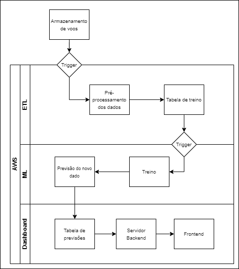

# Documentação Modelo Preditivo - Inteli

## Blue SkAI

- [Gabriel Pacsoli](https://www.linkedin.com/in/gabriel-pascoli-73733b200/)
- [Gariela Matias](https://www.linkedin.com/in/gabriela-rodrigues-matias/)
- [Giovanna Rodrigues](https://www.linkedin.com/in/giovanna-rodrigues-araujo/)
- [Henrique Matias](https://www.linkedin.com/in/henriquelfmatias/)
- [Lucas Henrique Sales](https://www.linkedin.com/in/lucas-henrique-sales-de-souza/)
- [Mihaell Alves](https://www.linkedin.com/in/mihaellalves/)
- [Vitor Queiroz](https://www.linkedin.com/in/vitor-zeferino/)

## Sumário

[1. Introdução](#1-introdução)

[2. Objetivos e Justificativa](#2-objetivos-e-justificativa)

[3. Metodologia](##)

[4. Desenvolvimento e Resultados](#c4)

## 1. Introdução

Fundada em 2008 e com sede em Barueri, a Azul desponta como a principal companhia aérea do Brasil, conquistando esse prestígio ao expandir suas asas para abranger mais de 150 destinos, tanto no âmbito nacional quanto internacional, estabelecendo-se como a líder em número de voos e cidades atendidas. No ano de 2020, a Azul adicionou um novo capítulo de sucesso à sua história ao ser agraciada com o prêmio de melhor companhia aérea do mundo pelo TripAdvisor Travelers' Choice, um feito que a tornou a única empresa brasileira a receber tal reconhecimento.

Dentro do cenário da Azul, há empreendimentos notáveis, como a TudoAzul, sua subsidiária de programa de fidelidade, que cria laços fortes com os clientes através de recompensas. Além disso, a AzulCargo se destaca como uma unidade de negócios voltada para fretamento de carga aérea de pequeno porte, oferecendo soluções eficientes de transporte.

A missão da Azul é clara: ser a melhor experiência profissional de seus funcionários e oferecer os melhores voos para seus clientes. A empresa desempenha um papel inspirador na aviação, conectando destinos, encurtando distâncias e mantendo altos padrões de excelência na indústria.

A fim de alcançar seu objetivo principal, é imperativo que se aborde de forma eficaz a questão associada ao Sistema de Bleed das aeronaves, pois tal problema não apenas resulta em gastos desnecessários para a empresa, mas também exercem um impacto negativo significativo na sua logística operacional. Nesse sentido, é crucial que a companhia resolva prontamente as questões relacionadas ao referido sistema, a fim de otimizar essa operação.

## 2. Objetivos e Justificativa

### 2.1 Objetivos

O sistema de Bleed de uma aeronave desempenha o papel de desviar parte do ar que entra no motor para atividades secundárias, como sistemas de ar-condicionado, pressurização da cabine e anti-ice. O ar extraído é direcionado por meio de válvulas e duros para os componentes necessários e depois é liberado da aeronave. Esse sistema otimiza a eficiência e o desempenho, garantindo uma operação segura e confortável ao manter essenciais condições ambientais e operacionais a bordo.

Na eventualidade de um defeito no sistema de Bleed, a aeronave mantém sua capacidade de voo, porém, com restrição de altitude, limitada ao máximo de Flight Level 310. Com essa limitação, devido a densidade e resistência do ar, há o maior consumo de combustível para manter a operação.

Em altitudes menores, a densidade atmosférica é amplificada, consequentemente, também há a maior resistência do ar. Para manter uma velocidade constante nessas condições, é essencial aumentar a potência do motor. Essa demanda adicional de potência se traduz em um consumo maior de combustível.

### 2.2 Proposta de solução

Logo, foi definido o desenvolvimento de um algoritmo de inteligência artificial que prevê o desgaste de componentes do sistema Bleed. Esse avanço busca antecipar com precisão o tempo até a falha do sistema, usando dados históricos e em tempo real, combinando técnicas de aprendizado de máquina e análise preditiva. Hospedado na nuvem, o algoritmo permite acesso global instantâneo, auxiliando operadores com informações essenciais para intervenções preventivas e otimização da manutenção da aeronave. Isso aponta para um futuro promissor na aviação, com a combinação de inteligência artificial e computação em nuvem melhorando a segurança e eficiência das operações.

#### 2.2.1 Diagrama em blocos

A arquitetura é composta por três componentes principais: ETL, Aprendizado de Máquina (Machine Learning) e Painel de Controle (Dashboard).

ETL: Nesta etapa, os dados destinados ao treinamento do modelo são selecionados e transformados na forma mais adequada para os algoritmos utilizados. Posteriormente, esses dados são armazenados em uma nova tabela.

Aprendizado de Máquina (ML): Nessa fase, o modelo é treinado com os dados recebidos, permitindo prever possíveis falhas em um período de tempo futuro.

Painel de Controle (Dashboard): As previsões são armazenadas em uma tabela adicional e essas informações são enviadas para um painel de controle por meio de um servidor backend.

Os triggers atuam como gatilhos que são acionados quando ocorre uma mudança no banco de dados. Assim, quando novos voos são adicionados, o processo de transformação dos dados e treinamento do modelo é realizado novamente.

#### 2.2.2 Requisitos funcionais

| **Código**   | **Requisito Funcional da Arquitetura em Cloud**                                                                                                         |
| ------------ | ------------------------------------------------------------------------------------------------------------------------------------------------------- |
| **RF-AC-01** | A arquitetura em cloud deve ter a capacidade de armazenar o modelo preditivo previamente treinado.                                                      |
| **RF-AC-02** | A arquitetura em cloud deve possuir uma maneira de armazenar dados em parquet.                                                                          |
| **RF-AC-03** | A arquitetura em cloud deve ter a capacidade de receber dados de agentes externos, como por exemplo uma api para alimentar um banco de dados ou bucket. |
| **RF-AC-04** | A arquitetura em cloud deve possuir uma maneira de identificar que novos dados chegaram e identifciar o que deve ser feito com ele.                     |
| **RF-AC-05** | A arquitetura em cloud deve possuir uma pipeline para tratar os dados para uma nova predição.                                                           |
| **RF-AC-06** | A arquitetura em cloud deve possuir uma estrutura de banco de dados para armazenar um histórico de predição.                                            |
| **RF-AC-07** | A arquitetura em cloud deve ser capaz de distribuir para vários clientes simultâneamente quais peças devem ser trocadas de quais aviões.                |

| **Código**   | **Requisito Funcional do Modelo Preditivo**                                                     |
| ------------ | ----------------------------------------------------------------------------------------------- |
| **RF-MP-01** | O modelo preditivo deve ser capaz de predizer uma peça que dará erro em uma aeronave específica |
| **RF-MP-02** | O modelo preditivo deve ser capaz de realizar a predição a partir de um arquivo parquet.        |

#### 2.2.3 Requisitos não funcionais

| **Código** | **Requisito não funcional**                                                                                                                            |
| ---------- | ------------------------------------------------------------------------------------------------------------------------------------------------------ |
| **RNF-01** | O sistema não deve expor o dataset, usado no modelo, de forma pública                                                                                  |
| **RNF-02** | O sistema deve garantir o armazenamento de informações em Cloud por questões de segurança                                                              |
| **RNF-03** | O sistema deve garantir compatibilidade com uma variedade de navegadores(Chrome, Safari e Opera?), garantindo uma experiência consistente dos usuários |
| **RNF-04** | O sistema deve alertar administradores em um período de 10 ciclos de antecedência de alguma falha                                                      |
| **RNF-05** | O modelo preditivo deve ser escrito em linguagem python                                                                                                |
| **RNF-06** | O modelo deve ter acurácia de 75% em identificar componentes perto do seu tempo de falha                                                               |

### 2.3 Estudo de viabilidade técnica

Estudo de Viabilidade Técnica para o Projeto de Detecção de Degradação de Componentes de Sistemas de Bleed em Aeronaves Embraer E2

**Objetivo do Projeto:**
Desenvolver um algoritmo de machine learning para detectar a degradação de componentes do sistema de bleed dos motores das aeronaves Embraer E2, visando reduzir o consumo de combustível e os custos operacionais.

**Viabilidade Técnica:**

1. **Complexidade do Algoritmo:**
   - O desenvolvimento de um algoritmo de machine learning eficaz e robusto pode ser complexo e demorado.
   - A escolha do algoritmo correto e a otimização de hiperparâmetros são críticas para o sucesso do projeto.
   - Possíveis ajustes frequentes podem atrasar o cronograma.**Estudo de Viabilidade Técnica para o Projeto de Detecção de Degradação de Componentes de Sistemas de Bleed em Aeronaves Embraer E2**

**Introdução:**
O projeto tem como objetivo desenvolver um sistema de manutenção preditiva para aeronaves Embraer E2, a fim de detectar a degradação de componentes do sistema de bleed dos motores. Este estudo de viabilidade técnica analisará a capacidade de concluir o projeto em um período de 10 semanas, identificando possíveis falhas técnicas que podem ocorrer durante o desenvolvimento.

**Análise de Viabilidade Técnica:**

1. **Complexidade do Projeto:**

   - O desenvolvimento de um algoritmo de machine learning e a integração com sistemas existentes podem ser desafiadores.
   - Falhas técnicas podem ocorrer se a complexidade não for adequadamente considerada.

2. **Experiência da Equipe:**

   - A equipe deve possuir conhecimentos em aprendizado de máquina, engenharia de dados e aviação.
   - Falhas podem ocorrer se a equipe não estiver preparada para lidar com desafios técnicos específicos.

3. **Integração com Sistemas Existentes:**

   - A integração do algoritmo com sistemas de monitoramento e coleta de dados pode ser complexa.
   - Falhas técnicas podem ocorrer se não houver compreensão clara dos requisitos de integração.

4. **Engenharia de Dados:**

   - A qualidade dos dados é crucial para o desempenho do modelo.
   - Falhas técnicas podem ocorrer se os dados não forem tratados adequadamente.

5. **Escolha e Desenvolvimento do Algoritmo:**

   - A seleção incorreta do algoritmo ou otimização inadequada de hiperparâmetros podem resultar em previsões imprecisas.
   - Falhas podem ocorrer se o algoritmo não atingir a acurácia desejada.

6. **Cronograma de 10 Semanas:**

   - O cronograma pode ser desafiador para um projeto com múltiplas etapas técnicas.
   - Falhas podem ocorrer se o planejamento não considerar adequadamente a complexidade das tarefas.

7. **Testes e Validação:**

   - A validação do modelo em diferentes cenários e testes rigorosos são essenciais.
   - Falhas técnicas podem ocorrer se os testes não forem abrangentes ou se falhas potenciais não forem identificadas.

8. **Acompanhamento e Monitoramento:**
   - A falta de monitoramento contínuo e ajustes do algoritmo pode resultar em falhas na detecção de degradação de componentes.
   - Falhas podem ocorrer se o sistema de alerta não estiver configurado adequadamente.

**Possíveis Falhas Técnicas e Mitigação:**

1. **Excesso de Complexidade:**

   - Mitigação: Analisar os requisitos detalhadamente e alocar recursos adequados.

2. **Falta de Experiência:**

   - Mitigação: Buscar treinamento adicional ou consultoria especializada quando necessário.

3. **Integração com Sistemas:**

   - Mitigação: Realizar testes de integração em pequena escala e garantir compreensão clara dos requisitos.

4. **Qualidade dos Dados:**

   - Mitigação: Garantir tempo suficiente para coleta, limpeza e preparação adequada dos dados.

5. **Seleção e Desenvolvimento do Algoritmo:**

   - Mitigação: Testar diferentes algoritmos e otimizar hiperparâmetros.

6. **Cronograma Ajustado:**

   - Mitigação: Dividir tarefas em sprints bem definidos, priorizando atividades críticas.

7. **Testes e Validação Adequados:**

   - Mitigação: Desenvolver planos de teste detalhados e abranger cenários diversos.

8. **Monitoramento Contínuo:**
   - Mitigação: Implementar sistema de alerta e monitorar desempenho do algoritmo.

**Conclusão:**
O projeto é viável, mas apresenta desafios técnicos que podem resultar em falhas se não forem adequadamente tratados. Com uma equipe experiente, planejamento cuidadoso e monitoramento contínuo, é possível mitigar as falhas potenciais e aumentar as chances de sucesso. A adaptação durante o desenvolvimento é essencial para enfrentar os desafios técnicos e alcançar os objetivos do projeto dentro do prazo estabelecido.

### 2.4 Análises de Mercado

Nesta seção, serão exploradas diversas análises de mercado que desempenham um papel crucial na estratégia de negócios. As análises abordadas oferecem insights valiosos para a compreensão do cenário competitivo e das oportunidades de crescimento. Desde o exame das propostas de valor até a avaliação de riscos e a identificação de possíveis espaços inexplorados, essa série de análises fornece uma visão abrangente para orientar as decisões estratégicas da organização.

#### 2.4.1 Canvas de Proposta de Valor

O "Canvas de Proposta de Valor" é uma ferramenta que permite a definição clara e concisa da proposta única que um produto ou serviço oferece aos clientes. Ao delinear os benefícios, diferenciais e valor que a empresa proporciona, essa análise ajuda a alinhar as estratégias de marketing e comunicação com as necessidades e desejos do público-alvo. A partir disso buscamos sinalizar a relação entre usuário e a nossa solução.

Dessa forma, nossa análise se inicia no mapeamento das tarefas que o cliente faz hoje, pois dessa forma conseguimos entender quais dores ele possui nessas tarefas. Depois disso, analisamos o que é nossa solução para entendermos quais são as características dela que vão satisfazer essas dores. Por fim, as características adicionais são criadores de ganhos, que trazem novos ganhos para o cliente.

## 2.4.2 Matriz de Oceano Azul

#### 2.4.2.1 Reduzir:

- **Treinamento de Pessoal:** Com a automação e um sistema mais intuitivo, há uma menor necessidade de treinamentos complexos para a equipe.

#### 2.4.2.2 Eliminar:

- **Verificações manuais constantes:** A automação prevê e identifica problemas, reduzindo a necessidade de verificações manuais constantes.
- **Complexidade de Monitoramento:** A automação da manutenção preditiva elimina essa complexidade do processo de monitoramento.

#### 2.4.2.3 Elevar:

- **Segurança:** Com alertas e identificação mais rápidos de problemas, a segurança geral da aeronave é aumentada.
- **Eficiência com Combustível:** Evitando problemas no sistema de bleed e otimizando a operação, a eficiência de combustível é aprimorada.
- **Comunicação de falhas:** Ao ocorrer uma falha o tripulante sabe rapidamente pelos alertas.
- **Tempo de Resposta a Problemas:** A detecção precoce permite ações mais rápidas.

#### 2.4.2.4 Criar:

- **Monitoramento em Tempo Real:** A solução pode oferecer um monitoramento mais refinado e em tempo real.

## 2.4.3 Matriz de Risco

### 2.4.3.1 Riscos:

#### Complexidade dos dados

- **Justificação:** Os dados podem conter múltiplas variáveis com inter-relações complexas. Isso pode dificultar o entendimento, a análise e a implementação de modelos adequados para manutenção preditiva.
- **Mitigação:** Fornecer treinamento adequado à equipe para trabalhar com esses conjuntos de dados complexos.

#### Complexidade no tratamento dos dados

- **Justificação:** Dados coletados com diferentes taxas de aquisição podem complicar o pré-processamento.
- **Mitigação:** Investir em treinamento ou contratar especialistas em processamento de dados para lidar com essa complexidade.

#### Falha no sistema de cloud

- **Justificação:** Dados armazenados em nuvem podem enfrentar problemas de disponibilidade ou segurança.
- **Mitigação:** Implementar redundâncias e backups regulares; considerar soluções de nuvem híbrida para maior controle.

#### Incompatibilidade com sistemas existentes

- **Justificação:** O novo sistema preditivo pode não ser totalmente compatível com os sistemas de TI existentes na Azul.
- **Mitigação:** Realizar testes de integração e talvez considerar middleware ou adaptadores para garantir compatibilidade.

#### Limitações tecnológicas

- **Justificação:** Ferramentas ou plataformas atuais podem não ser suficientes para lidar com a escala ou complexidade do projeto.
- **Mitigação:** Avaliar periodicamente as ferramentas e tecnologias utilizadas e considerar atualizações ou mudanças conforme necessário.

### 2.4.3.2 Oportunidades:

#### Otimização da Eficiência de Combustível:

Ao identificar e resolver problemas nos componentes do sistema de bleed dos motores antes de se tornarem críticos, a Azul pode otimizar o consumo de combustível, resultando em economia substancial.

#### Melhoria na Sustentabilidade Ambiental:

Menor consumo de combustível significa menos emissões de carbono, posicionando a Azul como uma empresa aérea mais ecológica, o que pode ser um diferencial no mercado.

#### Redução de Atrasos e Cancelamentos:

Ao prevenir falhas de componentes, a Azul pode reduzir atrasos e cancelamentos, melhorando a satisfação do cliente e a eficiência operacional.

#### Aumento da Confiabilidade da Frota:

Com uma manutenção mais proativa e preditiva, a frota da Azul se tornará mais confiável, resultando em menos tempo de inatividade para aeronaves.

#### Redução de Custos Operacionais:

Evitar falhas e otimizar operações pode resultar em economias significativas em termos de manutenção, reposição de peças e outras operações relacionadas.

#### 2.4.4 Analise Financeira

A análise financeria tem como o objetivo estimar valores aproximados para a implementação do projeto considerando seus principais custos e qunatidades. Dessa forma, para este projeto forma considerados como os principais custo o capital humano que seria utilizado para criação do modelo de manutenção prescritiva e todo o gerenciamento e tratamento dos dados recebido. Além disso, outro custo importante é sobre a infraestrutura e ferramentas para a realização projeto pensando em possibilidades escaláveis e efetivas no uso empresarial.

### 2.5 Justificativa

A adoção da manutenção preditiva para monitorar o desgaste dos componentes do sistema Bleed traz diversos benefícios, tais como:

- Aumento da eficiência dos recursos: Ao empregar a manutenção preditiva, as intervenções são realizadas somente quando há sinais concretos de desgaste ou iminente falha. Tal abordagem evita substituições prematuras de componentes e alocacões excessivas de recursos para manutenção preventiva.
- Redução de paradas não programadas: Garante a disponibilidade contínua da aeronave para operações sempre que necessário, diferentemente da manutenção corretiva que resulta em paradas imprevistas para reparos.
- Aprimoramento da segurança: A previsão do desgaste e ação antecipada antes de ocorrer uma falha elevam a segurança operacional, minimizando o risco de falhas repentinas que poderiam ocasionar acidentes ou incidentes.
- Planejamento e logística aprimorados: A manutenção preditiva possibilita um planejamento mais preciso e eficiente das operações e logística de manutenção. Isso contribui para evitar interrupções operacionais e otimizar a utilização dos recursos disponíveis.
- Aumento da sustentabilidade: impedindo a operação das aeronaves com falhas no sistema Bleed, ocorre uma redução no consumo de combustível.

## 3. Metodologia

### 3.2. Ciclo de Consumo e Sustentabilidade

No contexto atual, a Azul emprega um processo de manutenção de componentes da aeronave para assegurar o funcionamento contínuo do Sistema de Bleed. Esse procedimento envolve o acompanhamento manual dos dados de voo, o que pode ser trabalhoso e menos eficiente. No entanto, nosso projeto tem uma missão mais abrangente: automatizar todo o processo, da coleta ao emprego de métodos preditivos, com um olhar voltado para impacto social e ambiental positivo.

Acreditamos que a automação do gerenciamento de dados e a aplicação de modelos preditivos podem desempenhar um papel crucial na otimização da manutenção do Sistema de Bleed. Além disso, ao abordarmos essa questão com sensibilidade ambiental e social, nossos esforços ganham um novo significado.

Ao implementar um modelo preditivo avançado, não apenas capacitamos a Azul a realizar manutenção preventiva com base em previsões precisas, mas também reduzimos a quantidade de resíduos gerados devido a paralisações não programadas. Essa abordagem proativa contribui diretamente para a redução do impacto ambiental, ao evitar o consumo excessivo de recursos e a geração de resíduos associados a reparos emergenciais.

Além disso, ao otimizar a eficiência operacional da Azul por meio da automação da manutenção, estamos contribuindo para um transporte aéreo mais seguro e confiável, o que, por sua vez, impacta positivamente a experiência dos passageiros e a segurança de todo o setor de aviação.

Abaixo descrevemos um pouco de como funcionam os processos atuais, a relação com recursos e matérias-primas e a demonstração do funcionamento dos impactos sociais atrelados aos trabalhadores e até mesmo os ambientais relacionados à economia de recursos.

a. Requisitos de Visualização:
Nosso projeto tem como objetivo desenvolver uma análise preditiva avançada para otimizar os métodos e requisitos de manutenção do sistema de Bleed de aeronaves. Com base nisso, planejamos proporcionar uma visão abrangente dos dados, adaptada às necessidades específicas de cada área do nosso parceiro. A seguir expressamos os objetivos para cada área:

- Cientista de Dados: Nossa equipe será responsável por criar uma metodologia sólida para modelagem e treinamento de dados. Buscamos gerar previsões de falha do sistema de Bleed com um nível significativo de precisão. Essas previsões serão aplicáveis às aeronaves E2 fabricadas pela Embraer.
- Equipe de Manutenção: Nosso compromisso é fornecer uma interface gráfica intuitiva que apresente diferentes comportamentos e simulações possíveis para prever o desempenho do sistema de Bleed ao longo do tempo. Utilizando gráficos e tabelas claras, nossa interface permitirá que os responsáveis pela manutenção visualizem as tendências futuras e comportamentos esperados das peças. Isso viabilizará a programação antecipada da manutenção, assegurando a integridade dos componentes.

b. Ciclo de Consumo:
Embora o foco principal do projeto seja o estudo do sistema de bleed de uma aeronave, é de suma importância compreender integralmente o funcionamento da aeronave como um todo. Isso requer uma compreensão abrangente de todo o ciclo envolvido em seu funcionamento.

O ciclo começa com a fabricação dos componentes da aeronave, um processo que demanda a utilização de uma variedade de matérias-primas, como metais, plásticos e compósitos, para a produção de materiais essenciais. Este estágio inicial tem um impacto significativo no meio ambiente, causando diversos impactos ambientais, como o consumo de recursos naturais e a geração de resíduos industriais.

Uma vez que os componentes são fabricados, a montagem da aeronave se segue. Durante a operação da aeronave, surgem impactos ambientais adicionais, que incluem a emissão de gases, como dióxido de carbono (CO2), óxidos de nitrogênio (NOx) e partículas sólidas. Essas emissões contribuem para as mudanças climáticas e a poluição do ar.

É importante ressaltar que, em casos de mau funcionamento do sistema de bleed, a aeronave é forçada a voar em altitudes mais baixas, resultando em um aumento ainda maior no consumo de combustível. Isso não apenas aumenta os custos operacionais, mas também intensifica a pegada de carbono da aeronave.

Além disso, a gestão adequada do descarte dos componentes desgastados é crucial. O descarte inadequado desses materiais, como o despejo indiscriminado em aterros sanitários ou a queima sem controle, pode contaminar o solo e a água, causar a liberação de substâncias tóxicas e representar uma ameaça à saúde pública. Portanto, é fundamental seguir práticas de descarte ambientalmente responsáveis, considerando o tratamento adequado desses componentes, como a reciclagem de materiais recuperáveis e o descarte seguro de resíduos perigosos.

Por fim, após o descarte apropriado, a substituição dos componentes é necessária para reiniciar o ciclo. Compreender todos esses aspectos é fundamental para avaliar o funcionamento de uma aeronave de maneira abrangente e considerar seus impactos no meio ambiente ao longo de seu ciclo de vida.

A seguir temos o ciclo inicial do produto sem a implementação da nossa ferramenta:

Em seguida temos a aplicação da ferramenta no ciclo e os impactos causados:

## 4. Desenvolvimento e Resultados

### 4.1 Arquitetura dos dados

Foi desenvolvida uma base de arquitetura em camadas para os dados, pensando na estrutura de trabalho dos dados foram pensadas algumas etapas para a analise, tratamento e aplicação dos dados.

O próximo passo é uma etapa de Engenharia de Dados que tem como foco inicial o armazenamento das informações que pode ocorrer via data lake ou outros processos. Esses dados após armazenados passam por um processo de filtro e em seguida decodificação para o formato .parquet. Em seguida esses novos dados são passados para a etapa de Ciência de Dados, onde é realizado o pré-processamento descrito no item 3.1.3. para obter o melhor dataset para iniciar as etapas de treinamento e aplicação. O diagrama completo da arquitetura pode ser visualizado no item 3.1.5.

#### 4.1.1 Dados coletados

Dados Recebidos:
Recebemos uma série de arquivos no formato .parquet contendo as informações de leitura realizada para todos os componentes do sistema de Bleed durante diversos voos das aeronaves Embraer E2. Sendo que o intervalo de registro dos dados é de 50ms.

Os dados são organizados em colunas que descrevem cada uma das peças sinalizadas no sistema de bleed indicado na imagem acima.

Com base nos dados fornecidos foram definidas também quais seriam as colunas mais relevantes para serem trabalhadas no treinamento do modelo, todas elas estão definidas em relação a tipo de dado e frequência de registro na Tabela abaixo.

| Mnemonic                  | Description                                                                                               | Freq. | Enum                    |
| ------------------------- | --------------------------------------------------------------------------------------------------------- | ----- | ----------------------- |
| aircraftSerNum-1          | Aircraft serial number                                                                                    | 1     |                         |
| amscHprsovDrivF-1a        | Bleed Air System BAS LH High Pressure Shut-Off Valve HPSOV Driver Monitor [AMSC 1A]                       | 5     | 0=NOT FAILED; 1=FAILED  |
| amscHprsovDrivF-1b        | Bleed Air System BAS LH High Pressure Shut-Off Valve HPSOV Driver Monitor [AMSC 1B]                       | 5     | 0=NOT FAILED; 1=FAILED  |
| amscHprsovDrivF-2b        | Bleed Air System BAS RH High Pressure Shut-Off Valve HPSOV Driver Monitor [AMSC 2A]                       | 5     | 0=NOT FAILED; 1=FAILED  |
| amscPrsovDrivF-1a         | Bleed Air System BAS LH Pressure Regulating and Shut-Off Valve PRSOV Driver Monitor [AMSC 1A]             | 5     | 0=NOT FAILED; 1=FAILED  |
| amscPrsovDrivF-1b         | Bleed Air System BAS LH Pressure Regulating and Shut-Off Valve PRSOV Driver Monitor [AMSC 1B]             | 5     | 0=NOT FAILED; 1=FAILED  |
| amscPrsovDrivF-2b         | Bleed Air System BAS RH Pressure Regulating and Shut-Off Valve PRSOV Driver Monitor [AMSC 2A]             | 5     | 0=NOT FAILED; 1=FAILED  |
| basBleedLowPressF-1a      | Bleed Air System BAS LH Low Pressure Monitor [AMSC 1A]                                                    | 5     | 0=NOT ACTIVE; 1=ACTIVE  |
| basBleedLowPressF-2b      | Bleed Air System BAS RH Low Pressure Monitor [AMSC 2B]                                                    | 5     | 0=NOT ACTIVE; 1=ACTIVE  |
| basBleedLowTempF-1a       | Bleed Air System BAS LH Low Temperature Monitor [AMSC 1A]                                                 | 5     | 0=NOT ACTIVE; 1=ACTIVE  |
| basBleedLowTempF-2b       | Bleed Air System BAS RH Low Temperature Monitor [AMSC 2B]                                                 | 5     | 0=NOT ACTIVE; 1=ACTIVE  |
| basBleedOverPressF-1a     | Bleed Air System BAS LH Over Pressure Monitor [AMSC 1A]                                                   | 5     | 0=NOT ACTIVE; 1=ACTIVE  |
| basBleedOverPressF-2b     | Bleed Air System BAS RH Over Pressure Monitor [AMSC 2B]                                                   | 5     | 0=NOT ACTIVE; 1=ACTIVE  |
| basBleedOverTempF-1a      | Bleed Air System BAS LH Over Temperature Monitor [AMSC 1A]                                                | 5     | 0=NOT ACTIVE; 1=ACTIVE  |
| basBleedOverTempF-2b      | Bleed Air System BAS RH Over Temperature Monitor [AMSC 2B]                                                | 5     | 0=NOT ACTIVE; 1=ACTIVE  |
| bleedFavTmCmd-1a          | Bleed Air System BAS LH Fan Air Valve FAV Command [mA] [AMSC 1A]                                          | 5     |                         |
| bleedFavTmCmd-1b          | Bleed Air System BAS LH Fan Air Valve FAV Command [mA] [AMSC 1B]                                          | 5     |                         |
| bleedFavTmCmd-2a          | Bleed Air System BAS RH Fan Air Valve FAV Command [mA] [AMSC 2A]                                          | 5     |                         |
| bleedFavTmCmd-2b          | Bleed Air System (BAS) RH Fan Air Valve (FAV) Command [mA] [AMSC 2A]                                      | 5     |                         |
| bleedFavTmFbk-1a          | Bleed Air System (BAS) LH Fan Air Valve (FAV) Command Feedback [mA] [AMSC 1A]                             | 5     |                         |
| bleedFavTmFbk-1b          | Bleed Air System (BAS) LH Fan Air Valve (FAV) Command Feedback [mA] [AMSC 1B]                             | 5     |                         |
| bleedFavTmFbk-2b          | Bleed Air System (BAS) RH Fan Air Valve (FAV) Command Feedback [mA] [AMSC 2A]                             | 5     |                         |
| bleedHprsovCmdStatus-1a   | Bleed Air System (BAS) LH High Pressure Shut-off Valve (HPSOV) Command Status [AMSC 1A]                   | 10    | 0=CLOSED; 1=OPEN        |
| bleedHprsovCmdStatus-1b   | Bleed Air System BAS LH High Pressure Shut-off Valve HPSOV Command Status [AMSC 1B]                       | 10    | 0=CLOSED; 1=OPEN        |
| bleedHprsovCmdStatus-2a   | Bleed Air System BAS RH High Pressure Shut-off Valve HPSOV Command Status [AMSC 2A]                       | 10    | 0=CLOSED; 1=OPEN        |
| bleedHprsovCmdStatus-2b   | Bleed Air System BAS LH High Pressure Shut-off Valve HPSOV Open Position Status [AMSC 1A]                 | 10    | 0=CLOSED; 1=OPEN        |
| bleedHprsovOpPosStatus-1a | Bleed Air System (BAS) RH High Pressure Shut-off Valve (HPSOV) Command Status [AMSC 2A]                   | 10    | 0=NOT OPEN; 1=OPEN      |
| bleedHprsovOpPosStatus-1b | Bleed Air System BAS LH High Pressure Shut-off Valve HPSOV Open Position Status [AMSC 1B]                 | 10    | 0=NOT OPEN; 1=OPEN      |
| bleedHprsovOpPosStatus-2a | Bleed Air System BAS RH High Pressure Shut-off Valve HPSOV Open Position Status [AMSC 2A]                 | 10    | 0=NOT OPEN; 1=OPEN      |
| bleedHprsovOpPosStatus-2b | Bleed Air System BAS RH High Pressure Shut-off Valve HPSOV Open Position Status [AMSC 2B]                 | 10    | 0=NOT OPEN; 1=OPEN      |
| bleedMonPress-1a          | Bleed Air System BAS LH Monitoring Pressure BMPS [psig] [AMSC 1A]                                         | 5     |                         |
| bleedMonPress-1b          | Bleed Air System BAS LH Monitoring Pressure BMPS [psig] [AMSC 1B]                                         | 5     |                         |
| bleedMonPress-2a          | Bleed Air System BAS RH Monitoring Pressure BMPS [psig] [AMSC 2A]                                         | 5     |                         |
| bleedMonPress-2b          | Bleed Air System (BAS) RH Monitoring Pressure (BMPS) [psig] [AMSC 2A]                                     | 5     |                         |
| bleedOnStatus-1a          | Bleed Air System BAS LH Pressure Regulating and Shut-off Valve PRSOV Activation [AMSC 1A]                 | 10    | 0=BLEED OFF; 1=BLEED ON |
| bleedOnStatus-1b          | Bleed Air System BAS LH Pressure Regulating and Shut-off Valve PRSOV Activation [AMSC 1B]                 | 10    | 0=BLEED OFF; 1=BLEED ON |
| bleedOnStatus-2b          | Bleed Air System BAS RH Pressure Regulating and Shut-off Valve PRSOV Activation [AMSC 2A]                 | 5     | 0=BLEED OFF; 1=BLEED ON |
| bleedOverpressCas-2a      | CAS Message BLEED 2 OVERPRESS                                                                             | 5     | 0=NOT SET; 1=SET        |
| bleedOverpressCas-2b      | CAS Message BLEED 2 OVERPRESS                                                                             | 5     | 0=NOT SET; 1=SET        |
| bleedPrecoolDiffPress-1a  | Bleed Air System BAS LH Precooler Differential Pressure DPS [psid] [AMSC 1A]                              | 5     |                         |
| bleedPrecoolDiffPress-1b  | Bleed Air System BAS LH Precooler Differential Pressure DPS [psid] [AMSC 1B]                              | 5     |                         |
| bleedPrecoolDiffPress-2a  | Bleed Air System BAS RH Precooler Differential Pressure DPS [psid] [AMSC 2A]                              | 5     |                         |
| bleedPrecoolDiffPress-2b  | Bleed Air System (BAS) RH Precooler Differential Pressure (DPS) [psid] [AMSC 2A]                          | 5     |                         |
| bleedPrsovClPosStatus-1a  | Bleed Air System BAS LH Pressure Regulating and Shut-Off Valve PRSOV Closed Position Status [AMSC 1A]     | 10    | 0=NOT CLOSED; 1=CLOSED  |
| bleedPrsovClPosStatus-2a  | Bleed Air System (BAS) RH Pressure Regulating and Shut-Off Valve (PRSOV) Closed Position Status [AMSC 2A] | 10    | 0=NOT CLOSED; 1=CLOSED  |
| bleedPrsovFbk-1a          | Bleed Air System (BAS) LH Pressure Regulating and Shut-Off Valve (PRSOV) Command Feedback [mA] [AMSC 1A]  | 5     |                         |

Com base nos dados das seguintes colunas listadas, também nos foi fornecida uma listagem de possíveis resultados

| PARAMETER_NAME  | DESCRIPTION                   |
| --------------- | ----------------------------- |
| Message0418DAA1 | MC [BLEED 1 FAIL] - Displayed |
| Message0422DAA1 | MC [BLEED 2 FAIL] - Displayed |

#### 4.1.2 Armazenamento dos dados

##### Status Atual:
No cenário atual, os dados coletados estão sendo armazenados em um banco de informações mantido pela Embraer. As etapas de engenharia de dados mencionadas na seção de introdução do item 4.1 estão sendo executadas para garantir a qualidade e integridade dos dados. Isso resulta em um registro completo dos dados já coletados, os quais são então compartilhados com a Azul. A Azul é responsável por gerenciar o armazenamento desses dados e pela criação de painéis de controle que são supervisionados pelas equipes encarregadas da monitoração do sistema de manutenção. Essas informações são armazenadas em um banco de dados interno, que faz uso dos serviços Azure.

##### Planejamento:

Nosso plano estratégico consiste inicialmente em desenvolver todo o sistema de tratamento e pré-processamento dos dados. Com base nas técnicas de tratamento definidas, estabeleceremos um pipeline de dados bem estruturado, delineando as etapas necessárias para implementar e treinar nosso modelo de análise. Para isso, optaremos por empregar os serviços da AWS, que proporcionam um ambiente ideal para o armazenamento, gestão e organização eficiente das informações coletadas. Isso nos permitirá otimizar a exploração desses dados, conduzindo a resultados mais confiáveis e a insights valiosos para aprimorar nossas operações.

#### 4.1.3 Pré-processamento dos dados

##### Criação do dataframe

Os dados foram fragmentados e distribuídos em vários arquivos parquet, sendo que cada um deles representava um voo realizado pela aeronave. Em seguida, executou-se a operação de leitura individual de cada arquivo parquet, com a finalidade de incorporar seus conteúdos a um único dataframe abrangendo todos os voos.

Simultaneamente, no momento da inclusão de uma nova linha ao dataframe, optou-se por remover as colunas consideradas de pouca relevância para o modelo. A determinação dessas colunas foi realizada em colaboração com o cliente, que forneceu informações sobre quais colunas desempenhariam um papel mais crucial nas tomadas de decisões do modelo.

##### Mudança de tipo de dados

A demanda por processar esses dados impôs uma considerável carga operacional, resultando em um procedimento caracterizado por dificuldades e lentidão. Diante desse cenário, surgiu a resolução de reduzir a magnitude dos dados, preservando, contudo, sua qualidade. Nesse contexto, emergiu a alternativa de converter a estrutura de dados de 64 bits para 32 bits, uma escolha que se mostrou promissora para atingir o equilíbrio entre eficiência e integridade. Essa ação não apenas visava otimizar o processamento, mas também resguardar a essência informativa dos dados durante o procedimento de redução.

##### Redução no intervalo de tempo

A granularidade dos dados era notavelmente elevada, visto que os registros ocorriam a cada intervalo de 50 milissegundos. Entretanto, é relevante notar que determinadas colunas apenas eram marcadas em intervalos mais amplos, o que culminava na criação de linhas com valores nulos durante esses períodos intermediários. Dessa maneira, optou-se por uma abordagem que implicasse na redução desse intervalo inicial de 50 milissegundos para patamares de 1 segundo. Essa transformação operou por meio da aplicação de procedimentos como a determinação da moda, da média e uma soma horizontal para os valores contidos nesse intervalo, uma técnica que viabilizou a definição de novos valores para cada linha de forma mais precisa e contextualizada.

- Para os dados que foram escolhidos a média, a intenção era compreender se ouve grandes alterações no período de tempo que o sensor realizou as suas leituras.
- Para os dados que forma escolhidos a moda, a intenção era compreender qual a leitura em que a peça passou a maior parte do tempo.
- Para os dados que foram escolhidos a soma, a intenção era inputar frequência temporal na leitura do sensor.

O emprego dessas técnicas permitiu preencher as lacunas anteriormente ocupadas por valores nulos, conferindo uma maior completude ao conjunto de dados e, consequentemente, otimizando sua utilidade e aplicabilidade.

##### Normalização dos dados

Posteriormente, visando aprimorar a precisão do modelo, torna-se fundamental realizar a normalização dos dados. Essa prática visa promover a equalização de valores que originalmente se encontram em escalas diversas, harmonizando-os dentro de um intervalo unificado compreendido entre 0 e 1. A normalização, além de melhorar a acurácia do modelo, desempenha um papel crucial na redução do impacto das disparidades nas escalas sobre os algoritmos de aprendizado. Isso propicia uma representação mais equitativa das características individuais dos dados, contribuindo para um entendimento mais claro por parte do modelo e, consequentemente, potencializando sua capacidade de generalização para novos cenários.

Primeiramente guardamos o caminho do nosso dataset a ser normalizado, neste caso, o output gerado pela transformação de todos os datasets em uma linha de outro dataset. Chamamos ele de dataset consolidado.

Aqui selecionamos as colunas que iremos normalizar e armazenamos em um array. Após isso copiamos somente elas para um novo dataframe chamado 'df_normal'

No código abaixo, definimos uma constante 'DF_NORMAL' para nosso dataframe com as colunas a serem normalizadas. 
Logo abaixo, aplicamos a formula da normalização em todas as colunas, que nos retornará um valor entre 0 e 1, e substituimos todos os valores NaN (Not a Number) por 0

Por ultimo, apenas passamos os valoresdo dataframe normalizado para o dataframe consolidado original, levando em conta que eles inicialmente não possuiam as mesmas colunas

##### Procura por outliers

Com o intuito de evitar qualquer impacto prejudicial sobre o desempenho do modelo, é realizada uma busca ativa por outliers, que são valores que se desviam significativamente do padrão geral dos dados. Ao identificá-los, é possível adotar medidas apropriadas para tratá-los de forma eficaz, assegurando a integridade da análise.

A identificação e tratamento de outliers têm importância substancial na garantia da validade e confiabilidade dos resultados do modelo. Outliers podem surgir devido a erros de medição, ruídos nos dados ou eventos raros, e sua presença pode distorcer a distribuição dos dados e afetar negativamente a precisão do modelo. Ao detectá-los, a abordagem envolve comparar esses valores discrepantes com aqueles que compartilham características semelhantes, permitindo uma avaliação contextualizada de sua relevância.

Uma vez identificados, os outliers podem ser tratados de várias maneiras, dependendo da natureza dos dados e da análise pretendida. Opções incluem a remoção desses valores, substituição por valores mais apropriados ou até mesmo a segmentação dos dados em subgrupos, quando apropriado. A abordagem a ser escolhida depende da compreensão do contexto e dos objetivos do estudo, sempre visando minimizar o impacto negativo que os outliers poderiam exercer sobre a interpretação e o desempenho do modelo.

#### 4.1.4 Informações para treinamento

Para treinar um modelo, é necessário particionar os dados em features e targets. As features consistem nos conjuntos de informações empregados pelo algoritmo para identificar padrões, permitindo a determinação das respostas-alvo associadas a cada padrão. A escolha das features e targets foi realizada em colaboração com nosso parceiro, Azul. Dentro do conjunto de dados disponíveis, foram escolhidas 45 colunas para representar as características. Enquanto isso, para a variável alvo, foram selecionadas duas colunas que se relacionam à saúde de cada lado do sistema Bleed.

#### 4.1.5 Diagrama da arquitetura dos dados

## 4.2. ETL

### Extração dos Dados (Extraction)

### Transformação dos Dados (Transformation)
Iniciamos nossa análise identificando o comportamento das variáveis de resposta. Analisamos todos os voos das 17 aeronaves fornecidas pela Azul e observamos que as variáveis de resposta não são binárias. Além disso, nem todas as aeronaves apresentaram valores indicativos de possíveis falhas. Para esta análise, criamos o notebook: [Análise das Mensagens de Erro](/notebooks/grab_bleed_error.ipynb).

_Obs.: No referido notebook, foi gerado um novo arquivo parquet que registra o nome do arquivo com mensagens de erro distintas de 0, bem como os respectivos valores apresentados._

Para compreender se algum voo apresentou erro e não estava completo, selecionamos duas colunas como referência: `phaseOfFlight-1` e `phaseOfFlightNavigation-1`. Após consultar o material explicativo sobre estas colunas, identificamos os valores que deveriam ser apresentados para que um voo fosse considerado completo.

Com base nisso, analisamos as porcentagens de cada aeronave que tinha voos com mensagens de erro positivas e que estavam incompletos. Os resultados mostraram que três aeronaves tinham 100% de seus voos com mensagens de erro positivas e que estavam incompletos. Por outro lado, duas aeronaves não apresentaram nenhum voo com mensagens de erro positivas e que estavam incompletos.

Para esta análise, foram criados os seguintes notebooks:

- [Análise de Erros e Voos Incompletos](/notebooks/grab_bleed_error.ipynb)
- [Análise da relação de Voos Incompletos e mensagens de erro](/notebooks/grab_bleed_error_cutted_flights.ipynb)

Com base nas informações obtidas, decidimos condensar cada voo em uma única linha e, em seguida, agregar todos os registros de voos até o momento em que o erro é identificado. Para resumir cada voo:

- Somamos todos os valores que são binários, conforme especificado na cartilha.
- Calculamos a moda para valores que não são binários.
- Obtivemos a média para os valores referentes à diferença de pressão.
- Transformamos as colunas de resposta em valores binários (uma vez que identificamos que podem apresentar valores diferentes de 0 e 1) e os somamos.

_Obs.: Os métodos exatos utilizados podem ser vistos na terceira célula do arquivo: [Agrupando dados](/notebooks/transforming_datas_to_1_line.ipynb)_

O resultado foi um arquivo parquet para cada aeronave, onde cada voo é representado por uma linha, sem dados faltantes (NaN). A análise foi realizada e documentada no notebook: [Agrupando dados](/notebooks/transforming_datas_to_1_line.ipynb).

Após essa análise, partimos para agregar todos os registros de voos até o momento em que o erro é identificado. Para isso, continuamos seguindo o método de agregação de cada coluna. O resultado foi um parquet que cada linha representava o histório da aeronave até apresentar o erro. A análise foi realizada e documentada no notebook: [Agrupando histórico de erro](/notebooks/grab_errors_history.ipynb).

Portanto, a estrutura final dos dados que realizaremos os primeiros treinamentos é justamente um dataframe que cada linha é uma agregação do histórico de cada aeronave até o momento em que o erro é identificado. A partir disso, já identificamos alguns problemas, como uma redução exagerada dos dados, os quais podem ser vistos no notebook: [Agrupando histórico de erro](/notebooks/grab_errors_history.ipynb).

### Carregamento dos Dados (Loading)

#### Objetivo do Loading
O objetivo principal do carregamento de dados no projeto é criar um repositório centralizado e estruturado de informações relevantes para alimentar os modelos de Machine Learning. Esses modelos analisam os dados históricos e em tempo real para identificar padrões sutis, correlações e indicadores de possíveis falhas iminentes no sistema de "bleed". Ao treinar o modelo com uma quantidade suficiente de dados de boa qualidade, ele pode aprender a prever problemas potenciais antes que eles causem interrupções operacionais ou de segurança.

1. Dados de Monitoramento do Sistema: Dados operacionais do sistema de "bleed" precisam ser coletados e armazenados. Isso inclui leituras de pressão, temperatura, fluxo de ar, velocidade e outros parâmetros relevantes do sistema. Esses dados são extraídos regularmente dos sensores e componentes do avião.

2. Histórico de Manutenção: Informações detalhadas sobre manutenções passadas, reparos e substituições de componentes relacionados ao sistema de "bleed" devem ser registradas. Isso ajuda a entender o histórico de manutenção e a identificar padrões de falha.

3. Eventos de Falha: Dados sobre falhas anteriores no sistema de "bleed" são cruciais. Isso inclui o tipo de falha, a data e hora em que ocorreram, as ações tomadas para corrigi-las e o impacto nos voos e na operação geral.

#### Arquitetura do Armazenamento

Com base no objetivo principal do projeto e os objetivos de armazenamento, foi desenvolvida uma arquitetura em camadas para o sistema de armazenamento dos dados. Pensando desde a estrutura inicial considerando o armazenamento dos dados extraidos até a distribuição e manutenção desses dados. A arquitetura em relação a serviçoes e hosts de armazenamento é demonstrada no diagrama acima e descrita em cada um dos tópicos abaixo:

1. Camada Inicial de Armazenamento
Descrição: A camada inicial de armazenamento é responsável por receber os arquivos extraídos de diversas fontes. Esses arquivos são adicionados a um bucket de armazenamento no serviço Amazon S3 da AWS. Isso é realizado através de uma funcionalidade de inclusão de arquivos na interface do sistema. O Amazon S3 atua como um repositório seguro e escalável, garantindo que os dados brutos sejam armazenados de maneira confiável.

2. Dados Processados
Descrição: Após a inclusão de novos arquivos no Amazon S3, um fluxo de trabalho é desencadeado. Uma função, hospedada em uma instância Amazon EC2, é acionada para realizar o processamento dos novos dados em relação ao modelo de previsão. Essa função executa transformações e cálculos necessários para gerar os novos dados transformados. Após o processamento, os dados resultantes são armazenados nas tabelas hospedadas no serviço Amazon RDS (Relational Database Service) da AWS. Isso garante que os dados processados sejam mantidos de maneira estruturada e acessível.

3. Modelagem do Banco de Dados Processados
Descrição: Os dados armazenados no Amazon RDS seguem uma estrutura de banco de dados modelada para atender às necessidades do sistema. Esse banco de dados relacional é projetado para armazenar informações de aeronaves e suas previsões de falha no sistema de "bleed". Duas tabelas principais são definidas: uma para dados relacionados a cada aeronave e outra para as previsões de falha. Essas tabelas estão relacionadas de forma a fornecer informações relevantes para análise e tomada de decisões.

4. Distribuição dos Dados
Descrição: Para fornecer acesso e insights aos dados armazenados, um servidor é configurado usando o FastAPI. Esse servidor é integrado com o sistema da interface do usuário, ambos operando em contêineres Docker. O servidor atua como um intermediário que serve os dados armazenados no banco de dados para o sistema de interface. Isso permite a criação de um dashboard que exibe as informações relevantes. A integração entre o FastAPI e a interface Dockerizada garante a entrega eficiente e em tempo real dos dados aos usuários finais.

Esses passos representam o fluxo completo de dados no sistema, desde a aquisição até a apresentação, usando serviços e tecnologias da AWS e Docker para garantir a eficiência, escalabilidade e confiabilidade de todo o processo.

#### Sistema de Dockerização das Camadas 
O Docker é uma ferramenta que oferece benefícios essenciais para o desenvolvimento e implantação do sistema:

- Portabilidade: O Docker garante que seu sistema funcione de forma consistente em qualquer ambiente, eliminando problemas de compatibilidade.
- Isolamento: Cada contêiner executa de maneira isolada, evitando conflitos entre serviços ou aplicativos.
- Gerenciamento de Dependências Simplificado: Você pode definir todas as dependências no Dockerfile, garantindo ambientes uniformes.
- Implantação Rápida: As imagens Docker são criadas rapidamente, permitindo escalabilidade ágil e ambientes de teste.
- Colaboração Fácil: Equipes trabalham com ambientes consistentes, facilitando a colaboração e evitando discrepâncias.
- Nuvem e Escalabilidade: Docker é compatível com serviços em nuvem e plataformas de orquestração como Kubernetes.

No contexto do nosso sistema, dockerizar serviços front-end, back-end e AWS simplifica a implantação, configuração e escalabilidade, melhorando a eficiência do desenvolvimento e manutenção.

##### Docker - Server 
Este Dockerfile é responsável por criar um contêiner que executa o servidor FastAPI da sua aplicação.

###### Objetivo
O objetivo deste Dockerfile é fornecer um ambiente isolado e consistente para a execução do servidor FastAPI. Ele encapsula as dependências, configurações e arquivos necessários para executar o servidor de forma eficiente e previsível.

###### Estrutura
- Base Image: A imagem base usada é python:3.
- Diretório de Trabalho: Define o diretório de trabalho dentro do contêiner como /app.
- Instalação de Dependências: Copia o arquivo requirements.txt para o diretório de trabalho e instala as dependências Python listadas.
- Cópia de Arquivos do Projeto: Copia todos os arquivos do projeto para o diretório de trabalho.
- Porta Exposta: Expõe a porta 5000, que é a porta em que o servidor FastAPI estará em execução.
- Comando para Execução: Define o comando que será executado quando o contêiner for iniciado, no caso, a execução do arquivo main.py.

##### Docker Interface
Este Dockerfile cria um contêiner que executa o frontend Next.js da sua aplicação.

###### Objetivo
O objetivo deste Dockerfile é criar um ambiente isolado para a execução do frontend Next.js. Ele inclui o processo de compilação do código do Next.js para produção, encapsulando todas as dependências e arquivos necessários para a execução da interface.

###### Estrutura
- Base Image para Dependências: Usa a imagem base node:18-alpine para instalar as dependências de compilação.
- Instalação de Dependências: Copia os arquivos package.json e package-lock.json para instalar as dependências de produção do Next.js.
- Base Image para Build: Cria uma nova etapa do build que copia as dependências já instaladas para evitar reinstalações.
- Variáveis de Ambiente e Build: Configura variáveis de ambiente e executa o comando npm run build para compilar o projeto Next.js.
- Base Image para Execução: Cria uma etapa final para executar a interface, usando uma imagem mais leve do Node.js.
- Adicionar Usuário: Adiciona um usuário não privilegiado ao contêiner.
- Cópia de Arquivos para Imagem Final: Copia os arquivos necessários para a imagem final, incluindo os arquivos compilados do Next.js.
- Porta Exposta: Expõe a porta 3000, que é a porta em que a interface Next.js estará em execução.
- Variável de Ambiente de Porta: Configura a variável de ambiente PORT para 3000.
- Comando para Execução: Define o comando para iniciar a aplicação Next.js.

##### Arquivo docker-compose.yml
O arquivo docker-compose.yml é responsável por definir como os serviços de servidor e interface serão executados e interagem entre si.

###### Objetivo
O objetivo do arquivo docker-compose.yml é criar uma estrutura que permita a execução simultânea e integrada dos serviços de servidor e interface, simplificando a implantação e a execução do aplicativo como um todo.

###### Estrutura
O arquivo define dois serviços, "server" e "interface", cada um com suas próprias configurações. Para cada serviço, é especificado o processo de construção da imagem, mapeamento de portas e outras configurações específicas.

###### 4.2.1 ETL Processo de estração dados e armazenamento

O processo de Extração, Transformação e Carga de Dados (ETL) é de extrema importância para a análise preditiva, pois engloba a obtenção, preparação e armazenamento dos dados essenciais para a construção de modelos preditivos. No nosso contexto de projeto, é importante ressaltar que a extração de dados já é realizada pela Azul, que também executa o processo de decodificação. No entanto, é relevante mencionar que os dados passam por um processo intermediário antes de chegar aos nossos servidores da Azul, uma vez que transitam pelos servidores da Embraer antes de serem disponibilizados para nós.

Para melhor ilustrar o processo, podemos introduzir o Apache Kafka como um exemplo de tecnologia para comparação, já que ele é amplamente reconhecido por suas capacidades de processamento e armazenamento de dados em tempo real. Embora nossa solução já esteja em andamento, essa comparação pode oferecer insights valiosos sobre outras abordagens.

**Tecnología: Apache Kafka**

O Apache Kafka é uma plataforma de streaming distribuída projetada para lidar com fluxos de dados em tempo real de maneira escalável e confiável. Suas funcionalidades podem ser comparadas com nosso sistema atual:

**Benchmark 1: Taxa de Transferência (Throughput)**

Ao considerar a taxa de transferência, o Apache Kafka demonstra a capacidade de lidar com altos volumes de dados em tempo real. Por exemplo, em nosso sistema, a Azul já extrai os dados, mas comparativamente, o Kafka é capaz de processar 1 milhão de mensagens por segundo.

**Benchmark 2: Latência (Latency)**

A latência é crucial para cenários que requerem atualizações em tempo real. Enquanto os dados passam por um processo intermediário em nosso sistema, o Apache Kafka possui latência média inferior a 10 milissegundos, adequado para casos sensíveis à latência, como sistemas de monitoramento.

**Benchmark 3: Escalabilidade Horizontal**

Em nosso sistema, a capacidade de escalabilidade ocorre após a decodificação e transferência de dados da Azul. No entanto, o Apache Kafka apresenta escalabilidade linear, mantendo o desempenho constante mesmo com a adição de novos nós à infraestrutura.

**Benchmark 4: Garantia de Entrega**

O processo de garantia de entrega também se alinha com nossas operações atuais. No entanto, o Apache Kafka demonstra sua capacidade de garantir a entrega segura de mensagens, mesmo em casos de falhas.

**Benchmark 5: Disponibilidade**

A disponibilidade é fundamental, mesmo em situações adversas ou de alta demanda. Enquanto nossos servidores processam os dados após a fase intermediária, o Apache Kafka mantém alta disponibilidade em situações de carga extrema e falhas de nó.

**Conclusão**

A introdução do Apache Kafka como exemplo de tecnologia nos ajuda a compreender melhor as capacidades do nosso próprio sistema. Embora já estejamos processando dados após a extração e decodificação pela Azul, a comparação com o Apache Kafka destaca a eficácia da nossa abordagem atual e fornece ideias para melhorias futuras.

c) **Construção da Matriz de Decisão**Nesta fase, é recomendado criar uma matriz de decisão que liste as tecnologias avaliadas e os critérios relevantes. Atribuição de pesos aos critérios baseados em sua importância relativa para o projeto.

**Tecnologias Avaliadas:**

| Tecnologia      | Desempenho | Latência | Escalabilidade | Garantia de Entrega | Disponibilidade |
|----------------|------------|----------|----------------|---------------------|----------------|
| Apache Kafka   | 9          | 9        | 8              | 9                   | 8              |
| Sistema Atual  |  7         | 6        | 7              | 8                   | 7              |

**2. Extração dos Dados**:
a) **Obtenção dos Dados**No nosso projeto, os dados são extraídos pela Azul e passam pelo processo de decodificação.

**3. Transformação dos Dados**:
a) **Limpeza e Preparação**Realização de limpeza dos dados, tratando valores ausentes, duplicados e inconsistências. Transformações são aplicadas para padronizar formatos e unidades de medida.

b) **Integração**: A etapa intermediária no sistema atual garante a integração dos dados antes de serem processados.

**4. Carga dos Dados**:
a) **Preparação para o Armazenamento**Adequação dos dados transformados para o armazenamento, envolvendo a estruturação em tabelas ou formatos apropriados.

b) **Escolha do Armazenamento**Seleção do sistema de armazenamento mais adequado, como banco de dados relacional ou armazenamento em nuvem, de acordo com as demandas do projeto.

c) **Carregamento dos Dados**Carregamento dos dados transformados no sistema de armazenamento escolhido, garantindo a manutenção da integridade e consistência dos dados.

A documentação abrangente de todo o processo de ETL, desde a seleção de fontes até o armazenamento, é fundamental para assegurar a clareza e a reprodutibilidade das etapas realizadas. O processo de ETL desempenha um papel crucial na garantia da qualidade dos dados empregados na análise preditiva, influenciando diretamente a exatidão e confiabilidade dos modelos construídos.

